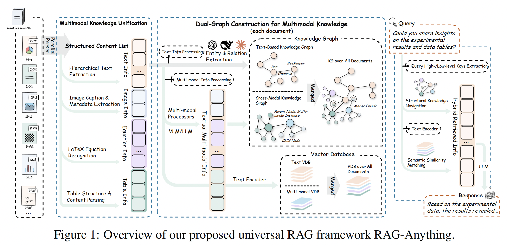

# Advanced Hybrid RAG for Multi-Domain Document Analysis

A high-performance hybrid RAG (Retrieval-Augmented Generation) system using LlamaIndex, designed for precision Q&A over complex PDF documents. It combines **MinerU** for structural parsing with **GLiNER** and **LangExtract** for deep metadata enrichment, enabling dynamic query routing via a **Sub-Question Query Engine**. The pipeline supports advanced retrieval strategies including BM25-Vector fusion, page-range filtering, and LaTeX-enabled response synthesis for technical and academic content.

## Quick Start

### Prerequisites

- **Apple Silicon Mac** (M1/M2/M3/M4): The pipeline is optimized for macOS with MPS (Metal Performance Shaders) acceleration for local parsing (**MinerU**) and entity extraction (**GLiNER**).
- **Python 3.11.1+**: The system is developed and tested on Python 3.11.
- **uv**: Astral's fast Python package manager is used for environment isolation and execution (auto-installed by `setup.sh` if missing).
- **Docker Desktop**: Required to host the database stack (**Milvus**, **MongoDB**, **Attu**) via the provided `db.sh` script (requires `sudo` privileges).
- **API Keys**: **OpenAI** (for embeddings), **Anthropic** (for Claude LLM), and **Google** (for Gemini Vision) keys are required in your `.env`.

### Installation

```bash
git clone -b v0.3.0 https://github.com/tonypeng1/llamaindex.git
cd llamaindex
bash setup.sh
```

### Database & GUI Management

This project uses **Milvus** (vector storage), **MongoDB** (document storage), and **Attu** (GUI). You can manage the entire stack using the included script (requires **Docker Desktop**; on macOS, the script will attempt to start Docker automatically if it's not running):

- **Start all services**:
  ```bash
  bash db.sh start_all
  ```
- **Access Attu (GUI)**: [http://localhost:3000](http://localhost:3000) (Connect to Milvus at `127.0.0.1:19530`)
- **Stop all services**:
  ```bash
  bash db.sh stop_all
  ```

#### MongoDB Connectivity
The `start_all` command automatically runs a MongoDB container. **However**, if you have a native MongoDB installation (e.g., via Homebrew) already running on port `27017`, the script will detect it and gracefully skip starting the Docker version to avoid conflicts.

#### MinerU Setup
The parsing pipeline requires an isolated environment, which is automatically created by `setup.sh` in `.mineru_env`. The main script manages this environment internally.

### Setup

1. **Document**: Add your PDF to the appropriate subdirectory under `./data/` (e.g., `./data/new_article/new_article.pdf`).
   - *Demo Paper*: The **Paul Graham essay** is automatically downloaded to `./data/paul_graham/` during the `bash setup.sh` step.

2. **API Keys**: Configure your `.env` file:
   ```
   OPENAI_API_KEY=your_key
   ANTHROPIC_API_KEY=your_key
   GOOGLE_API_KEY=your_key
   ```

3. **Configure**: Select the active article in `config.py`. The system automatically retrieves the corresponding query from `queries.py`:
   ```python
   # In config.py
   ACTIVE_ARTICLE = "paul_graham_essay"  # Options defined in ARTICLE_CONFIGS
   ```

4. **Run**:
   The `main.py` script is the primary entry point. It automatically detects if the document needs indexing (parsing via **MinerU**, enriching with **GLiNER**/**LangExtract**) and then executes the query:
   ```bash
   uv run main.py
   ```

### Adding a New PDF Article

1. **Place the PDF**: Add the file to `./data/new_article/new_article.pdf`.
2. **Update config.py**: Add a new entry to `ARTICLE_CONFIGS` with its directory, filename, and preferred `schema` (e.g., `"academic"`, `"technical"`). Set `ACTIVE_ARTICLE` to your new key. Add `ARTICLE_RAG_OVERRIDES` if needed.
3. **Update queries.py**: Add your queries to the file and map them in the `ACTIVE_QUERIES` dictionary.
4. **Execute**: Run `uv run main.py`.

## Documentation

- [Prompt Engineering](extraction_schemas.py): View the SQL-like schemas used for structured extraction.

## Features

| Feature | Description |
|---------|-------------|
| **Dual Storage** | Milvus (vectors) + MongoDB (documents) with deduplication |
| **Multi-Tool Query** | `keyphrase_tool` (facts), `page_filter_tool` (pages), `summary_tool` (summaries) |
| **Chronological Synthesis** | Automatic node deduplication and page-based sorting for coherent, sequential responses |
| **Unified Schemas** | Centralized hub for LangExtract and GLiNER with domain-specific sets (Academic, Financial, etc.) |
| **GLiNER Entities** | Zero-shot, domain-specific entity extraction on Apple Silicon |
| **Dynamic Filtering** | Extracts semantic filters (LangExtract) and entities (GLiNER) per sub-question |
| **Metadata Caching** | Local JSON caching for LangExtract results to minimize API costs |
| **Hybrid Retrieval** | Vector similarity + BM25 keyword search with reciprocal rank fusion |
| **Neural Re-ranking** | ColBERT for fine-grained relevance scoring |
| **MinerU Support** | Isolated PDF parsing pipeline optimized for Apple Silicon |

---

## Architecture & Data Processing

### The "Search-then-Fetch" Workflow
This system uses a dual-database architecture to balance search speed with context richness:

1.  **Milvus (The "Librarian"):** Stores mathematical **embeddings** and **Node IDs**. When you ask a question, Milvus identifies the most relevant IDs. It does *not* store or send the full text to the LLM.
2.  **MongoDB (The "Bookshelf"):** Stores the **full text** and **node relationships** (prev/next). Once Milvus finds the relevant IDs, the system "checks out" the full text from MongoDB.
3.  **Context Expansion:** If enabled, the system automatically retrieves neighboring nodes from MongoDB to provide the LLM with surrounding context.
4.  **Chronological Synthesis:** Before the final response is generated, the `SortedResponseSynthesizer` deduplicates all retrieved nodes and sorts them by page number. This ensures the LLM receives context in a logical, sequential order, which is critical for multi-page summaries and timeline-based queries.
5.  **Summary Path:** A separate MongoDB collection stores summary nodes, used exclusively by the `summary_tool` for "big picture" questions, bypassing the vector search entirely.

### Metadata Pipeline (Two-Stage Filtering)
The system applies metadata filters in two distinct phases:

1.  **Ingestion Stage (Extraction):** During `main.py` execution, **GLiNER** extracts named entities and **LangExtract** enriches nodes with structured semantic metadata (e.g., categories, advice types). The system uses a **Unified Schema Registry** in `extraction_schemas.py` to apply domain-specific configurations (Academic, Financial, Technical, etc.).
2.  **Retrieval Stage (Filtering):** When a query is processed in `rag_factory.py`, the `DynamicFilterQueryEngine` analyzes the query to extract relevant entities and semantic filters. These are applied as `MetadataFilters` to the vector search, ensuring the retriever only considers nodes matching the query's specific context.

### Multimodal Handling (MinerU)
The pipeline explicitly handles complex document elements to ensure high-fidelity retrieval:

*   **Entities (GLiNER):** Uses zero-shot NER to extract domain-specific entities (e.g., `MODEL`, `ALGORITHM`, `REVENUE`) based on the document type. This enables precise filtering during retrieval.
*   **Tables:** Extracted as HTML and converted to **Markdown**. This allows the LLM to reason about structured data naturally.
*   **Figures:** Dual-path handling — the original caption is included in the page text and also in a separate image-description node generated by **Gemini 3 Flash Agentic Vision** (with code execution for detailed analysis of fine details like labels, arrows, diagrams, trends). The pipeline extracts a normalized `figure_label` (e.g., `4.3`) into node metadata and supports decimal figure references (e.g., `fig. 4.3`). The retrieval logic ensures image nodes with matching `figure_label` are included in BM25/vector retrieval via precise metadata filtering, while tool-level support enables simultaneous resolution of multiple figure references (e.g., "Figure 4.1 and 4.3") in a single query.
*   **Equations:** Explicitly captured as **LaTeX** strings. This preserves mathematical precision for technical queries.

---

## Performance & Robustness

- **Metadata caching & persistence** — Results from **LangExtract** (LLM-based) and **Gemini Vision** (image descriptions) are persistently cached in local JSON files. High-cost API enrichment is performed only once per content chunk or image; subsequent runs recover metadata instantly from the cache.
- **Split-Brain Protection** — Automatic detection and recovery from inconsistent database states (e.g., missing Milvus collection but existing MongoDB docstore). The system ensures Node ID synchronization and only processes ingestion when necessary, making the pipeline idempotent.
- **Metadata stripping** — utilizes the `MetadataStripperPostprocessor` during retrieval to strip large enriched metadata (e.g., entity lists, image descriptions) before context synthesis, preventing LLM token limit blowups; the ingestion pipeline natively uses "lean" metadata for MinerU to ensure Milvus compatibility.
- **Optimized node splitting** — uses a 512-token default chunk size (configurable in `config.py` and aligned with ColBERT's limit) to ensure the reranker sees the entire context of every retrieved node.
- **Safer embedding & lazy init** — reduced embedding batch sizes and deferred query-engine initialization to lower failure rates and startup cost.
- **Robust Sub-Question Generation** — uses `LLMQuestionGenerator` with a 3-attempt retry mechanism to handle transient JSON parsing failures during query decomposition.
- **Optional detailed responses** — set `RESPONSE_MODE=TREE_SUMMARIZE` for verbose structured answers (higher token use).

---

## Configuration

### Metadata Extraction Options

| Option | Speed | Cost | Use Case |
|--------|-------|------|----------|
| `None` | ⚡⚡⚡ | Free | Quick testing |
| `"entity"` | ⚡⚡ | Free | **GLiNER** (Zero-shot NER via local HuggingFace model) |
| `"langextract"` | ⚡ | API | Rich semantic metadata (concepts, advice, experiences) |
| `"both"` | ⚡ | API | Maximum metadata richness |

### Centralized Configuration (`config.py`)

`config.py` is the **single source of truth** for the entire pipeline. Both the **Indexer** and the **Retriever** components import their settings from here to ensure database consistency.

#### 1. Select Active Article
Switch the entire system to a different document by changing one variable. This automatically updates the database names, storage paths, and metadata schemas:

```python
# config.py
ACTIVE_ARTICLE = "paul_graham_essay"  # Options: paul_graham_essay, attention_all, etc.
```

#### 2. Global RAG Settings
Default parameters optimized for ColBERT reranking and multimodal retrieval:

```python
# config.py
DEFAULT_RAG_SETTINGS = {
    "chunk_size": 512,         # Aligned with ColBERT's 512-token limit
    "chunk_overlap": 128,
    "chunk_method": "sentence_splitter",
    "metadata": "None",        # Options: "None", "entity", "langextract", "both"
    "use_entity_filtering": False,
    "similarity_top_k_fusion": 35,
    "num_queries": 1,          # Number of generated queries for fusion
    "fusion_top_n": 25,
    "rerank_top_n": 15,
}
```

---

## LangExtract Schema System

Managed in `extraction_schemas.py`, the system ensures metadata consistency across the pipeline through two operational modes:

| Mode | Phase | Source | Function |
|------|-------|--------|----------|
| **Static** | Ingestion | Hardcoded | Injects predefined categories into the LLM prompt to guide structured extraction. |
| **Dynamic** | Query Time | MongoDB | Queries `distinct()` values from the database to align search filters with actual stored metadata. |

### Schema Attributes

| Attribute | Examples |
|-----------|----------|
| `concept_categories` | technology, startups, programming |
| `advice_domains` | career, creativity, relationships |
| `experience_periods` | childhood, college, viaweb, yc |
| `experience_sentiments` | positive, negative, mixed |
| `entity_roles` | founder, colleague, investor |
| `time_decades` | 1970s, 1980s, 1990s, 2000s |

---

## Architecture

### Hybrid Retrieval Pipeline

```
Query → [BM25 (MongoDB)] ─┬─→ Reciprocal Rank Fusion → ColBERT Re-rank → Response
        [Vector (Milvus)] ─┘
```

### Entity Filtering Behavior

| Retriever | Database | Entity Filter | Rationale |
|-----------|----------|---------------|-----------|
| BM25 | MongoDB | ❌ | Preserve keyword matches |
| Vector | Milvus | ✅ | Improve entity precision |

### Dynamic Filter Query Engine

When entity filtering is enabled, `DynamicFilterQueryEngine` wraps the retrieval pipeline to extract fresh metadata filters for **each sub-question** rather than using filters from the original query.

**Why it matters**: For multi-part questions, the SubQuestionQueryEngine decomposes this into separate sub-questions. Each sub-question gets its own entity/time filters, ensuring accurate retrieval for each time period.

**Flow** (example query: *"What did Paul Graham do in 1980, in 1996 and in 2019?"*):
```
Original Query → SubQuestionQueryEngine → Sub-question 1 ("What did Paul Graham do in 1980?")
                                        → Sub-question 2 ("What did Paul Graham do in 1996?")
                                        → Sub-question 3 ("What did Paul Graham do in 2019?")
                                              ↓
                           DynamicFilterQueryEngine extracts filters per sub-question
                                              ↓
                           Vector retriever uses sub-question-specific filters
```

**Key behavior**:
- Filters are extracted dynamically at query time (not pre-computed).
- Each sub-question gets independent entity recognition and filter creation.
- **Robust Technical Extraction**: Includes a regex-based fallback to extract `figure_label` and `equation_label` directly from the query text, ensuring reliable filtering even if the NER model (GLiNER) fails to identify technical indices.
- BM25 retriever remains unfiltered; only vector retriever applies filters.

### Database Responsibilities

| Database | Role |
|----------|------|
| **MongoDB** | Document storage, BM25 retrieval, node relationships |
| **Milvus** | Vector storage, semantic search, metadata filtering |

---

## File Structure

| Category | Files |
|----------|-------|
| **Core Execution** | [main.py](main.py), [config.py](config.py), [queries.py](queries.py) |
| **Parsing & Enrichment** | [mineru_wrapper.py](mineru_wrapper.py), [gliner_extractor.py](gliner_extractor.py), [langextract_integration.py](langextract_integration.py), [extraction_schemas.py](extraction_schemas.py) |
| **RAG & Storage** | [rag_factory.py](rag_factory.py), [utils.py](utils.py), [db_operation.py](db_operation.py) |
| **Testing** | [test/](test/) (Evaluation and validation scripts) |
| **Setup** | [pyproject.toml](pyproject.toml), [requirements_mineru.txt](requirements_mineru.txt) |

---

## Showcase: Multimodal Understanding in Action

This example demonstrates the system's ability to process complex technical diagrams using its vision-capable retrieval pipeline. The following describes Figure 1 from the paper [RAG-Anything: A Universal Retrieval-Augmented Generation Framework](https://arxiv.org/abs/2510.12323).



📝 **QUERY**: Describe Figure 1 in detail. What visual elements and workflow does it show?

📝 **RESPONSE**:
# Detailed Description of Figure 1: RAG-Anything Universal Framework

Figure 1 presents a comprehensive visual representation of the RAG-Anything universal RAG framework, illustrating a sophisticated multimodal document processing and retrieval system. The figure is organized as a horizontal workflow diagram that demonstrates how diverse document types are processed to generate intelligent responses to user queries.

## Overall Architecture and Visual Organization

The framework is structured as a **left-to-right workflow** consisting of four distinct stages, each clearly delineated and connected through directional arrows that show the flow of information processing. The visual design employs a consistent color-coding scheme and iconography to distinguish different data types and processing components throughout the entire pipeline.

## Stage 1: Multimodal Knowledge Unification

### Input Document Processing
The workflow begins with a diverse collection of **Input Documents** represented by file icons showing various formats:
- **PPT** (PowerPoint presentations)
- **DOC** (Word documents) 
- **JPG** and **PNG** (image files)
- **XLS** (Excel spreadsheets)
- **PDF** (portable document format files)

### Parallel Parser System
These heterogeneous documents are processed through a **Parallel Parser** component, which serves as the central hub for document ingestion and initial processing. The parser creates a **Structured Content List** that organizes the extracted content for subsequent specialized processing.

### Specialized Extraction Processes
Four parallel extraction pipelines process different content modalities:

1. **Hierarchical Text Extraction**
   - Produces **Text Info** components
   - Visually represented by light orange rectangular boxes
   - Handles structured text content with hierarchical organization

2. **Image Caption & Metadata Extraction**
   - Generates **Image Info** components
   - Depicted using light blue rectangular boxes
   - Processes visual content and associated metadata

3. **LaTeX Equation Recognition**
   - Creates **Equation Info** components
   - Shown as light purple rectangular boxes
   - Handles mathematical formulas and equations

4. **Table Structure & Content Parsing**
   - Produces **Table Info** components
   - Represented by light green rectangular boxes
   - Processes tabular data and structural relationships

## Stage 2: Dual-Graph Construction for Multimodal Knowledge

This stage represents the core innovation of the framework, creating two complementary knowledge representations enclosed in dashed boxes for clear visual separation.

### Textual Multi-modal Information Processing
The extracted multimodal content is processed through **Multi-modal processors** utilizing Vision-Language Models (VLM) and Large Language Models (LLM) to convert all content into a unified textual representation for downstream analysis.

### Knowledge Graph Construction (Upper Dashed Box)

#### Text-Based Knowledge Graph
- Employs **Entity & Relation Extraction** processes
- Visual icons represent different processing engines (OpenAI, Ollama, and other providers)
- Extracts semantic entities (examples shown: "Bee", "Beekeeper") 
- Identifies relationships between entities (example: "Observe" relationship)
- Creates a structured graph representation of textual knowledge

#### Cross-Modal Knowledge Graph
- Represents relationships between **Parent Nodes** (multimodal instances) and **Child Nodes** (component elements)
- Captures cross-modal relationships and dependencies
- Maintains structural integrity across different content types

#### Graph Merging Process
Both knowledge graphs undergo a **Merge** operation to create a unified **KG over All Documents** containing **Merged Nodes** that represent the complete knowledge structure.

### Vector Database Construction (Lower Dashed Box)

#### Encoding Process
- Text and multimodal information are processed through a **Text Encoder**
- Creates separate vector representations: **Text VDB** and **Multi-modal VDB**
- Maintains semantic similarity relationships in high-dimensional vector space

#### Database Merging
The separate vector databases are **Merged** into a comprehensive **VDB over All Documents** that enables semantic similarity searches across all content types.

## Stage 3: Query Processing and Retrieval

### Query Input and Analysis
The system accepts user queries (example provided: *"Could you share insights on the experimental results and data tables?"*) and performs sophisticated query analysis.

### Dual Retrieval Strategy

#### Query Key Extraction
- **Query High-/Low-level Keys Extraction** component analyzes the input query
- Identifies both high-level concepts and specific low-level details
- Prepares query representations for both retrieval pathways

#### Structural Knowledge Navigation
- Utilizes the constructed **Knowledge Graph** for structural traversal
- Performs graph-based reasoning to identify related concepts and entities
- Leverages semantic relationships encoded in the knowledge structure

#### Semantic Similarity Matching
- Employs the **Text Encoder** to convert the query into vector representation
- Performs similarity searches against the **Vector Database**
- Identifies semantically related content across all document types

## Stage 4: Response Generation

### Information Fusion
The dual retrieval pathways converge to create **Hybrid Retrieved Info**, visually represented as a vertical column of colored boxes that maintain the original content type color coding (orange for text, blue for images, purple for equations, green for tables).

### Large Language Model Processing
The fused information is processed by a **Large Language Model (LLM)**, represented by a robot icon, which synthesizes the retrieved multimodal information into a coherent response.

### Final Output
The system generates a comprehensive **Response** (example shown: *"Based on the experimental data, the results revealed..."*) that integrates insights from multiple modalities and sources.

## Key Visual Design Elements and Technical Specifications

### Color Coding System
- **Light Orange**: Text information and components
- **Light Blue**: Image-related information and processing
- **Light Purple**: Mathematical equations and LaTeX content
- **Light Green**: Tabular data and structured information

### Structural Organization
- **Dashed Boxes**: Group related components within the dual-graph construction stage
- **Directional Arrows**: Show information flow and processing sequence
- **Consistent Iconography**: Maintains visual coherence across different processing stages

### Technical Integration Points
The framework demonstrates sophisticated integration between:
- Traditional text processing and modern multimodal understanding
- Graph-based structural knowledge and vector-based semantic similarity
- Multiple LLM/VLM providers for robust processing capabilities
- Diverse document formats unified under a single processing paradigm

This comprehensive visual representation effectively communicates the framework's ability to handle heterogeneous document types while maintaining semantic coherence and enabling sophisticated query-response capabilities through the innovative dual-graph approach combining both structural and semantic knowledge representations.

---

## Resources

- [Medium Article](https://medium.com/@tony3t3t/rag-with-sub-question-and-tool-selecting-query-engines-using-llamaindex-05349cb4120c): Implementation walkthrough and design patterns.
- [Test Suite](test/): Comprehensive validation for metadata, equations, and filtering.

---

## License

This project is licensed under the Apache License 2.0 - see the [LICENSE](LICENSE) file for details.
